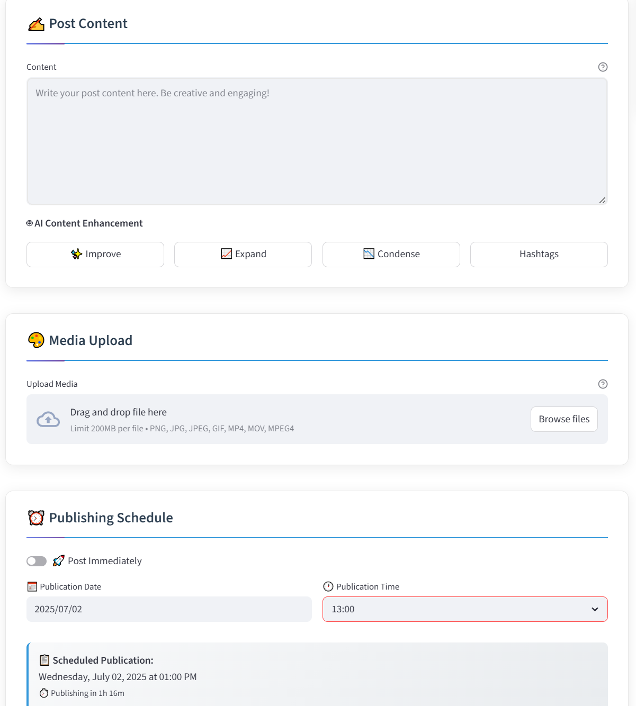

# Social Media Scheduler

[](https://www.python.org/downloads/)
[](https://streamlit.io/)
[](https://opensource.org/licenses/MIT)
[](CONTRIBUTING.md)

> A unified platform for scheduling and publishing content across multiple social media platforms. Manage Facebook, Instagram, Pinterest, Tumblr, X (Twitter), and more from a single dashboard with AI-powered content enhancement.

---

## 📑 Table of Contents

- [Features](#-features)
- [Demo](#-demo)
- [Supported Platforms](#-supported-platforms)
- [Quick Start](#-quick-start)
- [Installation](#-installation)
- [Configuration](#-configuration)
- [Usage](#-usage)
- [API Documentation](#-api-documentation)
- [Contributing](#-contributing)
- [License](#-license)
- [Support](#-support)

---

## 🎯 Features

### **Multi-Platform Publishing**
- **Simultaneous Posting**: Publish to multiple social media platforms at once
- **Smart Platform Selection**: Choose any combination of platforms with intelligent validation
- **Scheduled Publishing**: Set posts to publish at specific times, even while offline
- **Media Support**: Upload and attach images or videos with platform-specific optimisation

### **AI-Powered Content Enhancement** 
- **Text Improvement**: Enhance, expand, or condense your content
- **Title Generation**: AI-generated engaging post titles  
- **Multi-Provider Support**: OpenAI GPT, Anthropic Claude, Google Gemini
- **Content Optimisation**: Platform-specific content suggestions

### **Enterprise-Grade Security**
- **OAuth2 Authentication**: Secure login for all platforms
- **Token Management**: Automatic token refresh and secure storage
- **Database or File Storage**: Flexible credential management
- **Permission Control**: Granular access control per platform

### **Developer-Friendly**
- **Modular Architecture**: Easy to extend and customise
- **REST API Ready**: Built for integration (coming soon)
- **Comprehensive Logging**: Detailed success/error reporting
- **Docker Support**: Containerised deployment (planned)

---

## 🎬 Demo

### Quick Start Video
> *📹 Demo video coming soon - showing multi-platform posting in action*

### Screenshots

| Main Dashboard | Content Creation Interface |
|----------------|---------------------------|
|  |  |
| *Multi-platform selection, status dashboard, and real-time connection monitoring* | *AI-powered content enhancement, media upload, and smart scheduling* |

---

## 📱 Supported Platforms

| Platform | Status | Features | Auth Method |
|----------|--------|----------|-------------|
| **Facebook** | ✅ Live | Pages, media upload, scheduling | OAuth 2.0 |
| **Instagram** | ✅ Live | Business accounts, photos, videos | Facebook Graph API |
| **Pinterest** | ✅ Live | Boards, pins, image optimisation | OAuth 2.0 |
| **Tumblr** | ✅ Live | Multiple post types, blogs | OAuth 1.0a |
| **X (Twitter)** | ✅ Live | Text, media, threads | OAuth 2.0 + PKCE |
| **TikTok** | 🚧 Planned | Business accounts, videos | OAuth 2.0 |
| **Threads** | ⏳ Waiting | Text, media posts | Meta API (pending) |
| **LinkedIn** | 🚧 Planned | Professional content | OAuth 2.0 |
| **Personal Blog** | 🚧 Planned | Text, media | TBD |
---

## Features to add:

I'm looking to add additional features over the coming months, including:

### **🔗 Multi-Account Management**
- **Multiple Accounts Per Platform**: Manage several Facebook pages, Instagram accounts, or Twitter profiles
- **Account Switching**: Quick toggle between different accounts without re-authentication
- **Bulk Account Setup**: Import and configure multiple accounts simultaneously
- **Account Grouping**: Organise accounts by brand, client, or campaign

### **✨ Enhanced User Experience**
- **Streamlined Interface**: Redesigned dashboard with improved workflow and navigation
- **Content Calendar View**: Visual calendar interface for scheduling and managing posts
- **Drag & Drop Scheduling**: Simply drag posts to different time slots
- **Quick Actions**: One-click posting, duplication, and rescheduling
- **Mobile-Responsive Design**: Full functionality on tablets and mobile devices

### **📊 Analytics & Insights**
- **Performance Dashboard**: Track engagement, reach, and clicks across all platforms
- **Best Time Suggestions**: AI-powered optimal posting time recommendations
- **Content Performance Analysis**: Understand which posts perform best
- **Cross-Platform Analytics**: Compare performance across different social networks
- **Export Reports**: Generate detailed analytics reports in PDF/CSV format

### **🤖 Advanced AI Features**
- **Smart Hashtag Generation**: AI-suggested hashtags based on content and trends
- **Content Variations**: Generate platform-specific versions of the same post
- **Trend Analysis**: Real-time trending topics and content suggestions
- **Auto-Optimisation**: Automatically adjust content for platform-specific requirements
- **Language Translation**: Multi-language content generation and translation

### **👥 Team Collaboration**
- **Multi-User Access**: Team accounts with role-based permissions
- **Content Approval Workflows**: Review and approve posts before publishing
- **Comment Management**: Centralised comment moderation across platforms
- **Brand Guidelines**: Enforce consistent branding and tone across team members
- **Activity Logs**: Track who posted what and when

### **⚡ Advanced Scheduling**
- **Recurring Posts**: Set up daily, weekly, or monthly recurring content
- **Time Zone Support**: Schedule posts for different global audiences
- **Bulk Operations**: Upload and schedule hundreds of posts via CSV import
- **Content Queues**: Set up automated posting queues with smart spacing
- **Seasonal Campaigns**: Plan and execute holiday and seasonal content campaigns

### **🔧 Integration & Automation**
- **REST API**: Full API access for custom integrations and third-party tools
- **Webhook Support**: Real-time notifications for post status updates
- **RSS Feed Integration**: Automatically post from your blog or news feeds
- **Content Library**: Centralised media storage with tagging and search
- **Template System**: Save and reuse post templates and layouts

### **📱 Platform Expansion**
- **TikTok Business**: Full video scheduling and management
- **LinkedIn Company Pages**: Professional networking content management
- **YouTube Shorts**: Short-form video scheduling and optimisation
- **Snapchat Business**: Snap ads and story management
- **WhatsApp Business**: Broadcast message scheduling

### **🚀 Enterprise Features**
- **White-Label Solution**: Rebrand the platform for your agency or business
- **Advanced Security**: SSO, 2FA, and enterprise-grade data protection
- **Custom Integrations**: Bespoke integrations with your existing tools
- **Dedicated Support**: Priority support with dedicated account management
- **On-Premise Deployment**: Self-hosted solutions for maximum data control

---

## 🚀 Quick Start

Get up and running in 5 minutes:

```bash
# 1. Clone the repository
git clone https://github.com/DrJonoG/social-media-scheduler.git
cd social-media-scheduler

# 2. Install dependencies
pip install -r requirements.txt

# 3. Set up environment
cp .env_example .env
# Edit .env with your API keys

# 4. Run the application
python main.py
```

Open `http://localhost:8501` and start scheduling! 🎉

---

## 💻 Installation

### Prerequisites

- **Python 3.8+** ([Download](https://www.python.org/downloads/))
- **Git** ([Download](https://git-scm.com/downloads))
- **Social Media Developer Accounts** (see [Configuration](#-configuration))

### Option 1: Standard Installation

```bash
# Clone repository
git clone https://github.com/DrJonoG/social-media-scheduler.git
cd social-media-scheduler

# Create virtual environment (recommended)
python -m venv .venv
source .venv/bin/activate  # On Windows: .venv\Scripts\activate

# Install dependencies
pip install -r requirements.txt
```

### Option 2: Docker Installation (Coming Soon)

```bash
# Pull and run with Docker
docker run -p 8501:8501 social-media-scheduler:latest
```

---

## ⚙️ Configuration

### 1. Environment Setup

Copy the example environment file and configure your API keys:

```bash
cp .env_example .env
```

### 2. Platform Authentication

Run the interactive setup scripts for each platform you want to use:

```bash
# Facebook Pages
python scripts/facebook_setup.py

# Instagram Business
python scripts/instagram_setup.py

# Pinterest Boards  
python scripts/pinterest_setup.py

# Tumblr Blogs
python scripts/tumblr_setup.py

# X (Twitter)
python scripts/x_setup.py
```

### 3. Database Setup (Optional)

For production use, set up MySQL:

```bash
# Set USE_DATABASE=true in .env
# Run the SQL script
mysql -u username -p database_name < app/db/mysql_create_tables.sql
```

For development, SQLite is used automatically.

### 4. AI Configuration (Optional)

Add your AI provider API keys to `.env`:

```env
# Choose one or more
OPENAI_API_KEY=your_openai_key
ANTHROPIC_API_KEY=your_anthropic_key  
GEMINI_API_KEY=your_gemini_key
```

---

## 📖 Usage

### Basic Posting

1. **Launch the dashboard**: `python main.py`
2. **Select platforms**: Choose which social media platforms to post to
3. **Create content**: Write your post and add media
4. **Choose timing**: Post now or schedule for later
5. **Publish**: Click publish and watch it go live across all platforms!

### AI Enhancement

1. **Write your content**: Start with a basic post
2. **Select AI action**: Choose improve, expand, condense, or generate title
3. **Review results**: AI-enhanced content appears instantly
4. **Publish**: Post your optimised content across platforms

### Scheduling

1. **Toggle "Schedule Later"**: Switch from immediate posting
2. **Pick date and time**: Choose when your content should go live
3. **Confirm**: Your post will be published automatically

---

## 🛠️ Tech Stack

- **Backend**: Python 3.8+, FastAPI (planned)
- **Frontend**: Streamlit
- **Database**: MySQL / SQLite
- **Scheduling**: APScheduler
- **Authentication**: OAuth 2.0/1.0a via requests-oauthlib
- **AI Integration**: OpenAI, Anthropic, Google Gemini APIs

---

## 🤝 Contributing

We welcome contributions! Please see our [Contributing Guide](CONTRIBUTING.md) for details.

### Quick Contribution Steps

1. **Fork** the repository
2. **Create** a feature branch (`git checkout -b feature/amazing-feature`)
3. **Commit** your changes (`git commit -m 'Add amazing feature'`)
4. **Push** to the branch (`git push origin feature/amazing-feature`)
5. **Open** a Pull Request

### Development Setup

```bash
# Clone your fork
git clone https://github.com/DrJonoG/social-media-scheduler.git

# Install development dependencies
pip install -r requirements-dev.txt

# Run tests
python -m pytest tests/
```

---

## 📄 License

This project is licensed under the MIT License - see the [LICENSE](LICENSE) file for details.

---

## 💬 Support

- **Documentation**: [Full documentation](https://docs.example.com) 
- **Issues**: [GitHub Issues](https://github.com/DrJonoG/social-media-scheduler/issues)
- **Discussions**: [GitHub Discussions](https://github.com/DrJonoG/social-media-scheduler/discussions)

---

## 🌟 Star History

[](https://star-history.com/#DrJonoG/social-media-scheduler&Date)

---

## 🙏 Acknowledgments

- Built with ❤️ using [Streamlit](https://streamlit.io/)
- Inspired by the needs of content creators and social media managers
- Special thanks to all contributors and the open-source community

---

**Made for creators, by creators** 🚀
